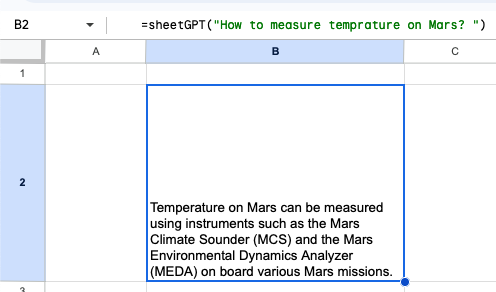
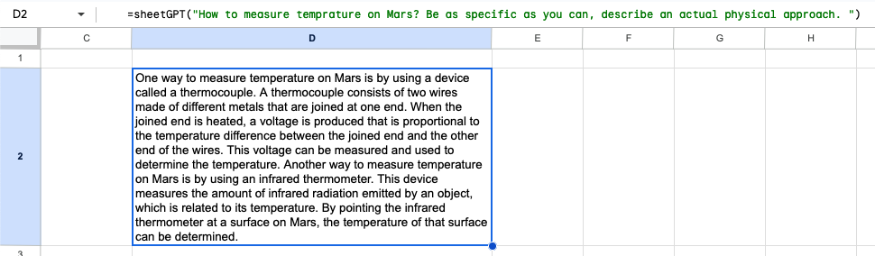
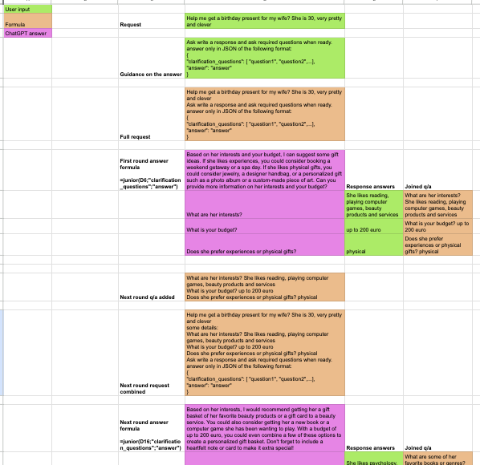
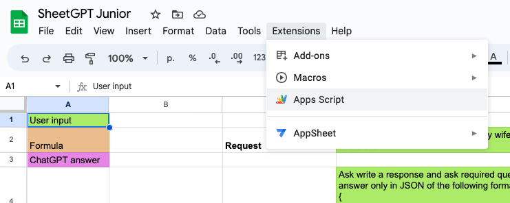
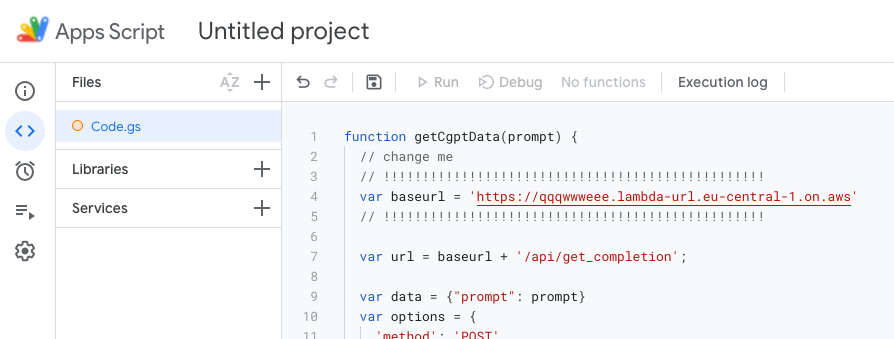
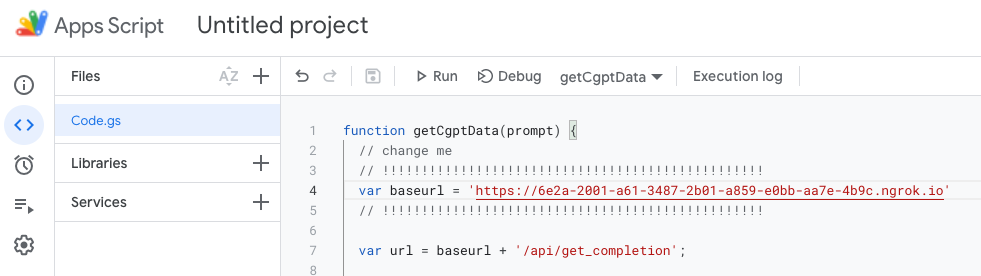
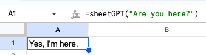
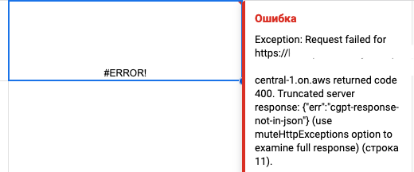
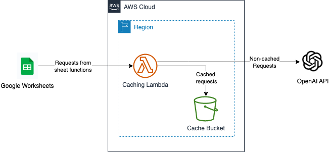

# SheetGPT
Integrates ChatGPT into Google Sheets. No middleman reading your prompts involved.

⚠️ Alpha version, for geeks only ⚠️

## Functions
### =sheetGPT(question)
As simple as it could be, just ask your question in the function parameter and get an answer.

### =junior(question, array_key, answer_key, params)
This function is the purpose of the whole endeavor. It is meant to be used in the following case: you have a question which involves several steps to get the best possible answer. During each step, you:
1. Ask ChatGPT for an intermediate answer and clarification questions to improve an answer
2. (optional) Ask ChatGPT for examples of "good" answers for clarifying questions
3. Answer the clarifying questions and get a new version of end-result, after which the process repeats as required. 

[Demo worksheet](https://docs.google.com/spreadsheets/d/1HQzDNCudIpUftqMLJcFtar5jfn5qoJBjNzJhdk09eCc/edit?usp=sharing)

## Setup
### Local
1. Clone this repo
2. `python3 -m venv .venv && source .venv/bin/activate`
3. `pip install -r requirements.txt`
4. `cp .env.example .env`
5. Edit `.env`, put your OpenAI key there (you can get your API key on [platform.openai.com](https://platform.openai.com/account/api-keys))
6. `python sheetgpt.py` and go to [localhost:5000](http://localhost:5000), you should see `working` message
7. (optional) if you want to run SheetGPT from you local computer, use [ngrok](https://ngrok.com/) or [localhost.run](https://localhost.run) to forward port 5000 and use the resulting URL in the Google Apps Script later
### In AWS using [AWS CDK](https://github.com/aws/aws-cdk)
1. Do the local setup part
2. `pip install -r requirements-cdk.txt`
3. `cdk bootstrap && cdk deploy`, as output you will get a Lambda Function URL like this `https://[some letters].lambda-url.eu-central-1.on.aws`
4. Check that Lambda Function works by visiting the address, you should see `working` message. If not — use supplied `logs.sh` script, which will tail function logs to the terminal, and fix the errors

After any kind of function setup, preceed to the 

### Google Sheets setup
1. Create new or open existing [Google Sheet](https://docs.google.com/spreadsheets/)
2. Go to Extensions -> Apps Script

3. Copy/Paste the code from [sheets.js](./sheets.js) to Code.gs

4. Change the baseUrl variable to point to your code endpoint and save the project

You are all set! Now you can query ChatGPT from Google Sheets!

## Known problems

Sometimes ChatGPT refuses to answer in JSON-only. In most of the cases, slightly changing the request fixes the problem.
You can retrigger the request by adding a dummy parameter to the method and trace the actual answer in logs manually or using provided `logs.sh` command which tails logs from CloudWatch.

## Motivation
It feels natural to treat complex problems as problem trees (or graphs), where you go from root problem statement and dig into more and more details as solution process flows.

Original ChatGPT interface doesn't feel comfortable tackling such a problems, because you are limited to straight flow only. And when you are going deep into one single problem, ChatGPT tends to forget previous correcttions, at least in my experiments.

To explore possibilities of such tree-structured writing flow, I created a simple adapter of ChatGPT to Google Sheets.

## Architecture

## ADR
The architecture involves a caching layer function written in Python. It is anavoidable because of two things:
1. Responsiveness. OpenAI API is really unstable: response times are from milliseconds to 10s of seconds, it can even timeout from time to time. You'd better use cached responses as hard as you can.
2. Money. Google Sheets re-evaluate sheet's data from time to time. Why whould you pay for repeated requests
3. Cost. Caching layer will use AWS free tier only (if you won't share your Google Sheet with millions of users)
4. Security. Your endpoint URL is randomly generated both in case you use local deployment and when you use Lambda Function URL. 
